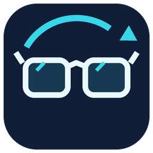

# Kariuss Max Headtracking

**[English documentation](README_EN.md) · Tiếng Việt**

Theo dõi chuyển động đầu bằng **Rokid Max trên Windows**, kết nối trực tiếp với game qua FreeTrack / TrackIR. Không cần mở ứng dụng OpenTrack riêng.

**Bản thử 1.8.0 — Tiếng Việt / English.** Đã được người dùng thử với Rokid Max và Microsoft Flight Simulator 2024. Chưa xác nhận hỗ trợ các mẫu kính hoặc game khác.

## Tải app

Mở [Releases](https://github.com/KhangNguyen1307/Rokid-max-Headtracking/releases), tải gói **Windows x64**, giải nén toàn bộ rồi mở **Kariuss Max Headtracking.exe**. Giữ thư mục `_internal` cạnh tệp `.exe`. Không cần cài Python để dùng bản đóng gói.

## Sử dụng

1. Cắm Rokid Max vào một cổng USB có truyền dữ liệu trên PC.
2. Mở app. Chọn kính trong ô thiết bị nếu có nhiều kính; tên thiết bị không hiện số sê-ri.
3. **Đặt trên mặt phẳng 6 giây để kính hiệu chỉnh.**
4. Đeo kính, nhìn thẳng rồi bấm **Reset góc nhìn** hoặc **F8**.
5. Tắt OpenTrack nếu đang mở. Bấm **Kết nối game**, mở game và vào buồng lái.
6. Nếu game chưa nhận, giữ kết nối Kariuss đang bật rồi khởi động lại game.

Ô **Tiếng Việt / English** ở góc trên bên phải đổi ngôn ngữ ngay, gồm nút, trạng thái, nhật ký đang hiển thị và menu cạnh đồng hồ. Lựa chọn được lưu tự động; đổi ngôn ngữ không đổi cài đặt theo dõi. Bản nâng cấp giữ tiếng Việt cho người dùng cũ; lần chạy đầu trên Windows dùng ngôn ngữ khác tiếng Việt sẽ mặc định English.

| Màu nút Kết nối game | Ý nghĩa |
|---|---|
| Xanh lá | Game đã đăng ký kết nối và tiến trình có thành phần nhận dữ liệu còn đang chạy |
| Đỏ | Đã bật nhưng chưa có game kết nối, hoặc không bật được kết nối |
| Xám | Đã tắt kết nối |

App kiểm tra tiến trình game khoảng mỗi giây. Màu xanh không phải xác nhận game đã sử dụng mọi lần cập nhật hướng nhìn.

## Chức năng

- Mô hình kính 3D trên trang chính; quay trái/phải, ngẩng/cúi, nghiêng đầu.
- Reset góc nhìn, tạm dừng / tiếp tục; lựa chọn đảo chiều từng hướng.
- USB tự kết nối lại khi rút và cắm dây; nút kết nối / ngắt và tìm lại USB.
- Bấm × để chạy ngầm; mở lại từ biểu tượng cạnh đồng hồ hoặc mở app lần nữa. **Thoát hẳn** để dừng hoàn toàn.
- Nhật ký hoạt động có thời gian, lưu cài đặt tự động.
- Gán thêm hành động cho nút kính; mặc định bấm tăng rồi giảm âm lượng (hoặc ngược lại) trong 0,8 giây để reset.

### Độ mượt và độ nhạy

| Mức | Tác dụng |
|---|---|
| Tắt | Bỏ lớp làm mượt bổ sung |
| Mượt nhẹ | Lọc ít hơn, phản hồi nhanh hơn |
| Mượt vừa | Mức mặc định, dùng cách làm mượt thích nghi từ Accela của OpenTrack |
| Mượt nhiều | Giảm rung nhiều hơn, phản hồi chậm hơn |

Độ nhạy mặc định **80%**: khi đã theo kịp, quay đầu 30° tương ứng khoảng 24° gửi vào game. Mô hình biểu diễn chuyển động kính thực, không bị nhân độ nhạy của game.

**Tần số gửi:** 44,4 / 50 / 80 / 100 / 140 / 200 Hz, mặc định 100 Hz. Đây là số lượt cập nhật hướng nhìn ra game mỗi giây, khác với số gói app nhận từ kính. Nhịp thực tế có thể thấp hơn khi máy bận. Reset được xử lý ngay.

## Hình ảnh trên kính và FPV

App đọc cảm biến; tín hiệu hình ảnh cần đường xuất hình riêng từ PC. Cổng USB-C chỉ có dữ liệu không tự tạo được hình ảnh trên kính. Nếu dùng bộ chuyển HDMI/DisplayPort sang USB-C, cần kiểm tra bộ chuyển có truyền dữ liệu USB để app vẫn đọc được kính.

**Chưa hỗ trợ điều khiển camera FPV thật.** Các mức tần số đã chuẩn bị cho việc phát triển phần này, chưa có ngõ ra PPM, PWM, SBUS hoặc CRSF. Có tham khảo [HeadTracker](https://github.com/headtracker/HeadTracker) về các mức gửi; không đưa mã firmware của dự án đó vào app.

## Giới hạn

- Chỉ đọc ba hướng quay; ba số vị trí X/Y/Z gửi vào game luôn là 0.
- Hướng nhìn có thể trôi; dùng F8 để đặt lại hướng giữa.
- App không chặn chức năng gốc của nút kính. Nút độ sáng vẫn đổi độ sáng; nút âm lượng vẫn đổi âm lượng.
- Kết nối trực tiếp dùng các thư viện tương thích đi kèm từ OpenTrack. `TrackIR.exe` là thành phần hỗ trợ nhỏ chạy ẩn, không phải app OpenTrack.
- Chưa có bộ cài hoặc tự cập nhật. Đây là bản thử, chưa phải phần mềm điều khiển bay FPV.

## Dành cho người sửa mã

Xem [BUILDING.md](BUILDING.md) để chạy mã, kiểm tra và đóng gói trên Windows x64 với Python 3.12. Các gói nguồn đi kèm và cách thay thư viện được ghi tại [THIRD_PARTY.md](THIRD_PARTY.md).

Nhật ký và cài đặt của bản đóng gói nằm trong `%LOCALAPPDATA%/Kariuss Max Headtracking`. Các dữ liệu này không được đưa vào kho mã. Trước khi gửi báo lỗi, hãy che thông tin cá nhân trong ảnh hoặc nhật ký.

## Giấy phép và nguồn

Mã Kariuss được phát hành theo **GNU GPL v3.0**; xem [LICENSE](LICENSE). Các thành phần bên thứ ba giữ giấy phép và thông tin tác giả riêng; xem [THIRD_PARTY.md](THIRD_PARTY.md) và thư mục `licenses/`.

Ghi nhận: [OpenTrack](https://github.com/opentrack/opentrack), [VQF](https://github.com/dlaidig/vqf), [ar-drivers-rs](https://github.com/badicsalex/ar-drivers-rs) (tham khảo bố cục gói Rokid), [pystray](https://github.com/moses-palmer/pystray), [cython-hidapi](https://github.com/trezor/cython-hidapi).

